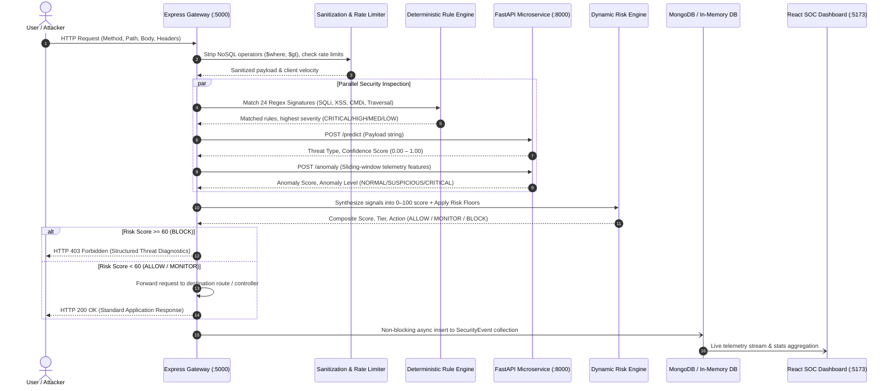

# SentinelAI: AI-Powered Application Security & Intrusion Detection Platform

[](LICENSE)
[]()
[](https://nodejs.org/)
[](https://www.python.org/)
[](https://fastapi.tiangolo.com/)
[](https://react.dev/)
[]()
[](https://www.docker.com/)
[]()

> **SentinelAI** is a portfolio-grade, real-world application security and intrusion detection platform. It unifies **deterministic WAF rules**, **character-level TF-IDF NLP machine learning**, **unsupervised behavioral anomaly detection**, and an automated **dynamic risk scoring engine** with **non-dilution risk floors** to protect web applications against multi-vector attacks in real time.

---

## Table of Contents

1. [Executive Overview & Problem Statement](#1-executive-overview--problem-statement)
2. [System Architecture & Data Flow](#2-system-architecture--data-flow)
3. [Zero-Friction Setup & Demo Accounts](#3-zero-friction-setup--demo-accounts)
4. [Getting Started (Two Launch Modes)](#4-getting-started-two-launch-modes)
   - [Mode A: Docker Compose (One-Click Stack)](#mode-a-docker-compose-one-click-stack)
   - [Mode B: Bare-Metal Local Development](#mode-b-bare-metal-local-development)
5. [Complete Feature Testing Guide (11 End-to-End Scenarios)](#5-complete-feature-testing-guide-11-end-to-end-scenarios)
   - [Automated Test Suites](#automated-test-suites)
   - [Hands-On Testing Scenarios](#hands-on-testing-scenarios)
     - [Test 1: SQL Injection (SQLi) Detection & Gateway 403 Blocking](#test-1-sql-injection-sqli-detection--gateway-403-blocking)
     - [Test 2: Cross-Site Scripting (XSS) & Path Traversal / LFI Interception](#test-2-cross-site-scripting-xss--path-traversal--lfi-interception)
     - [Test 3: Brute-Force Credential Stuffing & Account Lockout (HTTP 423)](#test-3-brute-force-credential-stuffing--account-lockout-http-423)
     - [Test 4: Behavioral Anomaly Detection via Isolation Forest](#test-4-behavioral-anomaly-detection-via-isolation-forest)
     - [Test 5: Interactive Threat Sandbox (Web UI Deep Inspection)](#test-5-interactive-threat-sandbox-web-ui-deep-inspection)
     - [Test 6: Live SOC Threat Feed & Forensic Incident Triage](#test-6-live-soc-threat-feed--forensic-incident-triage)
     - [Test 7: Attack Analytics & Recharts Telemetry Visualizations](#test-7-attack-analytics--recharts-telemetry-visualizations)
     - [Test 8: Deterministic WAF Rule Catalog & Signatures](#test-8-deterministic-waf-rule-catalog--signatures)
     - [Test 9: Access Governance & Administrative RBAC](#test-9-access-governance--administrative-rbac)
     - [Test 10: System & Microservice Cluster Health Monitoring](#test-10-system--microservice-cluster-health-monitoring)
     - [Test 11: Network IDS Layer 3/4 Flow Intrusion Classifier](#test-11-network-ids-layer-34-flow-intrusion-classifier)
6. [Machine Learning & Security Methodology](#6-machine-learning--security-methodology)
   - [Attack Payload Classifier (TF-IDF + Logistic Regression)](#1-attack-payload-classifier-tf-idf--logistic-regression)
   - [Behavioral Anomaly Detector (Isolation Forest)](#2-behavioral-anomaly-detector-isolation-forest)
   - [Dynamic Risk Engine & Defensive Risk Floors](#3-dynamic-risk-engine--defensive-risk-floors)
7. [API Reference Summary](#7-api-reference-summary)
8. [Repository Structure](#8-repository-structure)
9. [Security Hardening & Production Compliance](#9-security-hardening--production-compliance)
10. [Documentation Index](#10-documentation-index)

---

## 1. Executive Overview & Problem Statement

### The Problem in Modern Web Security

Modern web applications are subjected to sophisticated multi-vector attacks ranging from code injections (SQLi, XSS, Command Injection, Path Traversal) to automated credential stuffing, high-velocity directory fuzzing, and API flooding.

1. **Why Traditional WAFs Fail**: Legacy Web Application Firewalls rely on static regular expression patterns. Attackers bypass them with URL encoding schemes, polyglot payloads, token splitting, and zero-day variations. Furthermore, strict signatures suffer from high false-positive rates on benign inputs (e.g., Markdown formatting, JSON schemas, mathematical expressions).
2. **Why Standalone AI Fails**: Pure machine learning models lack operational security context and cannot provide deterministic guarantees. More critically, naive weighted averaging creates a **risk dilution vulnerability**: an overt, lethal SQL injection payload might be assigned a low composite risk score simply because peripheral traffic velocity or the user's account age appears normal.

### The SentinelAI Solution

SentinelAI solves this dilemma through **Defense-in-Depth Engineering**:

```
                         INBOUND HTTP REQUEST
                                  │
                                  ▼
                     [Express Security Gateway]
                                  │
        ┌─────────────────────────┼─────────────────────────┐
        ▼                         ▼                         ▼
 [Deterministic Rules]     [NLP AI Classifier]     [Isolation Forest]
  24 Compiled Signatures    Char TF-IDF + LogReg    Sliding-Window Telemetry
  Sub-millisecond match     99.86% Accuracy / F1    Velocity & Entropy Bursts
        │                         │                         │
        └─────────────────────────┼─────────────────────────┘
                                  ▼
                       [Dynamic Risk Engine]
                    Multi-Signal Normalization (0–100)
                     Defensive Risk Floor Overrides
                                  │
                 ┌────────────────┼────────────────┐
                 ▼                ▼                ▼
               ALLOW           MONITOR           BLOCK (HTTP 403)
              (0 – 29)        (30 – 59)         (60 – 100)
                                  │
                                  ▼
               [Non-Blocking Security Event Logger]
                                  │
                                  ▼
                     [MongoDB / In-Memory DB]
                                  │
                                  ▼
               [React Security SOC Operations Center]
```

- **Zero-Bypass Deterministic Layer**: 24 modular rules detect known exploit patterns instantly.
- **NLP Vectorized AI Layer**: Sub-word character n-gram TF-IDF (2–5 grams) captures obfuscated payload semantics with **99.86% accuracy**.
- **Behavioral Anomaly Layer**: Unsupervised Isolation Forest scores request velocity, peak burst density, failed login rates, and endpoint entropy in **6.34 µs**.
- **Non-Dilution Dynamic Risk Engine**: Synthesizes telemetry across 6 dimensions. Mathematically enforced **risk floors** guarantee that high-confidence exploits or critical rule matches immediately trigger an HTTP `403 Forbidden` block regardless of other benign metrics.
- **Dark Cyber SOC Dashboard**: Real-time triage, live attack analytics, forensic inspection modal, and interactive threat sandbox.

---

## 2. System Architecture & Data Flow

### Request Lifecycle Sequence



### Component Responsibility Matrix

| Component | Technology | Primary Function | Port |
|---|---|---|---|
| **React SOC Dashboard** | React 18, Vite, Tailwind CSS, Recharts, Lucide Icons | Real-time cyber operations center: telemetry feeds, attack analytics, manual sandbox, RBAC governance | `5173` |
| **Express Security Gateway** | Node.js, Express, Helmet, Mongoose, JWT, bcryptjs | Deep request inspection middleware, rate limiting, sanitization, risk floor enforcement, security event dispatch | `5000` |
| **Deterministic Rule Engine** | JavaScript RegExp, modular signature catalogs | Sub-millisecond pattern matching across 24 rules (SQLi, XSS, Path Traversal, Command Injection) | Internal |
| **Dynamic Risk Engine** | JavaScript mathematical normalization | 6-signal weighted normalization (0–100), severity tiering, non-dilution risk floor overrides | Internal |
| **FastAPI AI Microservice** | Python 3.13, FastAPI, Uvicorn, scikit-learn, joblib | Payload attack classification (`POST /predict`), behavioral anomaly detection (`POST /anomaly`), network flow IDS (`POST /network/flow`) | `8000` |
| **Behavioral Sliding Engine** | In-memory sliding windows (60s & 10s), Mongoose | Real-time calculation of velocity, burst density, 4xx error rate, path entropy, and inter-arrival intervals | Internal |
| **Storage Layer** | MongoDB 7.0 + Automatic In-Memory Storage Fallback | Audit logging (`SecurityEvent`), user profiles (`User`), behavioral tracking (`UserBehaviour`) | `27017` |

---

## 3. Zero-Friction Setup & Demo Accounts

### Automatic In-Memory Database Fallback

> [!TIP]
> **No Local MongoDB Installation Required!**  
> SentinelAI is engineered for zero-friction evaluation. If a local MongoDB instance is not detected, the Express Gateway automatically boots an **in-memory storage engine** pre-populated with sample security events, realistic traffic logs, and active demo accounts. You can test the entire platform immediately out-of-the-box.

### Pre-Configured Demo Credentials

Two pre-configured accounts are pre-seeded in both MongoDB and In-Memory modes:

| Role | Email Address | Password | Permissions |
|---|---|---|---|
| **Administrator** | `demo.admin@sentinelai.local` | `AdminPassword123!` | Full system governance, Admin & RBAC tab, user role elevation, account unlocking, security audit |
| **SOC Analyst** | `demo.analyst@sentinelai.local` | `AnalystPassword123!` | Threat Event Feed, forensic incident triage, status updates, investigative notes, Threat Sandbox |

*(A 1-click **Demo Login** shortcut button is also provided directly on the web application login modal for instant evaluation).*

---

## 4. Getting Started (Two Launch Modes)

### Prerequisites

- **Node.js**: v18+ (tested on Node v18 through v25)
- **Python**: v3.10+ (tested on Python 3.10 through 3.13)
- **Git**
- *(Optional)*: Docker & Docker Compose, MongoDB 7.0

---

### Mode A: Docker Compose (One-Click Stack)

Run the entire multi-container stack (MongoDB, FastAPI AI Microservice, Express Gateway, and React Client) with a single command:

```bash
docker compose up --build
```

#### Running Services

- **SOC Dashboard**: [http://localhost:5173](http://localhost:5173)
- **Express API Gateway**: [http://localhost:5000](http://localhost:5000) (Health: `GET /api/health`)
- **FastAPI AI Microservice**: [http://localhost:8000](http://localhost:8000) (Docs: `GET /docs`, Health: `GET /health`)
- **MongoDB Database**: `localhost:27017`

To shut down the stack:
```bash
docker compose down
```

---

### Mode B: Bare-Metal Local Development

#### Step 1: Clone Repository & Configure Environment

```bash
git clone https://github.com/vedantjoshi18/SentinelAI.git
cd SentinelAI
cp .env.example .env
```

*(The default `.env` is already pre-configured for immediate local execution).*

#### Step 2: Launch the FastAPI AI Microservice

```bash
cd ai-service

# Create and activate Python virtual environment
# Windows (PowerShell):
python -m venv venv
.\venv\Scripts\Activate.ps1

# Linux / macOS (bash):
python3 -m venv venv
source venv/bin/activate

# Install dependencies
pip install -r requirements.txt

# Start FastAPI server
uvicorn app.main:app --host 127.0.0.1 --port 8000 --reload
```

*Verification: Visit [http://127.0.0.1:8000/health](http://127.0.0.1:8000/health). It should report `"status": "ok"` with `modelLoaded: true`.*

#### Step 3: Launch the Express Security Gateway

Open a second terminal:

```bash
cd server
npm install
npm run dev
```

*Verification: Visit [http://localhost:5000/api/health](http://localhost:5000/api/health). It will report `"status": "ok"` along with database and AI service connectivity.*

#### Step 4: Launch the React SOC Dashboard

Open a third terminal:

```bash
cd client
npm install
npm run dev
```

*Access the live SOC Dashboard at [http://localhost:5173](http://localhost:5173).*

---

## 5. Complete Feature Testing Guide (11 End-to-End Scenarios)

This section provides reproducible verification instructions for every platform feature using both **CLI commands** (`curl` / PowerShell) and the **Web SOC UI**.

### Automated Test Suites

Before manual verification, confirm that all unit, integration, and security test suites pass:

```bash
# 1. Run Server Tests (130 automated tests covering rules, risk floors, RBAC, hardening)
cd server
npm test

# 2. Run AI Microservice Tests (29 automated pytest cases covering classifiers, anomaly, network IDS)
cd ai-service
pytest

# 3. Verify Client Production Bundle (0 errors)
cd client
npm run build
```

---

### Hands-On Testing Scenarios

#### Test 1: SQL Injection (SQLi) Detection & Gateway 403 Blocking

- **Objective**: Verify that an inbound SQL injection exploit is intercepted by the security gateway, triggering an HTTP 403 Forbidden response with security diagnostics, and increments the SOC dashboard counters.
- **CLI Execution Command**:
  ```bash
  curl -i -X POST http://localhost:5000/api/auth/login \
    -H "Content-Type: application/json" \
    -d '{"email": "admin@sentinelai.local", "password": "' OR 1=1 --"}'
  ```
- **Expected CLI Output**:
  ```http
  HTTP/1.1 403 Forbidden
  Content-Type: application/json; charset=utf-8

  {
    "success": false,
    "error": "Request blocked by SentinelAI Security Gateway",
    "threatType": "SQL_INJECTION",
    "severity": "HIGH",
    "riskScore": 85,
    "action": "BLOCK"
  }
  ```
- **UI Verification**:
  1. Open [http://localhost:5173](http://localhost:5173) and view **SOC Overview**.
  2. Notice the **Intrusions Blocked** counter increments by 1.
  3. Navigate to **Live Threat Feed** (`/threats`): The blocked incident appears at the top with an `SQL_INJECTION` tag and `BLOCK` status badge.

---

#### Test 2: Cross-Site Scripting (XSS) & Path Traversal / LFI Interception

- **Objective**: Verify that DOM-based event handler injections and directory traversal vectors are strictly neutralized.
- **XSS Test Command**:
  ```bash
  curl -i -X POST http://localhost:5000/api/users/profile \
    -H "Content-Type: application/json" \
    -d '{"name": ""}'
  ```
  *Expected Output*: `HTTP 403 Forbidden` with `"threatType": "XSS"`, `"riskScore": 85`.

- **Path Traversal / LFI Test Command**:
  ```bash
  curl -i -X GET "http://localhost:5000/api/users?file=../../../../etc/passwd"
  ```
  *Expected Output*: `HTTP 403 Forbidden` with `"threatType": "PATH_TRAVERSAL"`, `"riskScore": 85`.

---

#### Test 3: Brute-Force Credential Stuffing & Account Lockout (HTTP 423)

- **Objective**: Demonstrate that 5 consecutive failed authentication attempts automatically lock the victim account with HTTP 423 Locked.
- **CLI Execution (Linux/macOS Bash)**:
  ```bash
  for i in {1..5}; do
    curl -s -X POST http://localhost:5000/api/auth/login \
      -H "Content-Type: application/json" \
      -d '{"email": "victim@sentinelai.local", "password": "WrongPassword!"}'
  done
  ```
- **CLI Execution (Windows PowerShell)**:
  ```powershell
  1..5 | ForEach-Object {
    Invoke-RestMethod -Uri "http://localhost:5000/api/auth/login" -Method Post -ContentType "application/json" -Body '{"email":"victim@sentinelai.local","password":"WrongPassword!"}' -SkipHttpErrorCheck
  }
  ```
- **The 6th Attempt**:
  ```bash
  curl -i -X POST http://localhost:5000/api/auth/login \
    -H "Content-Type: application/json" \
    -d '{"email": "victim@sentinelai.local", "password": "WrongPassword!"}'
  ```
- **Expected CLI Output**:
  ```http
  HTTP/1.1 423 Locked
  Content-Type: application/json; charset=utf-8

  {
    "success": false,
    "error": "Account temporarily locked due to excessive failed attempts. Try again in 15 minutes."
  }
  ```

---

#### Test 4: Behavioral Anomaly Detection via Isolation Forest

- **Objective**: Validate the AI microservice's ability to identify high-velocity directory fuzzers and abnormal burst distributions without explicit regex signatures.
- **CLI Execution Command**:
  ```bash
  curl -i -X POST http://localhost:8000/anomaly \
    -H "Content-Type: application/json" \
    -d '{
      "request_frequency": 120.0,
      "burst_frequency": 35.0,
      "failed_auth_count": 0,
      "error_4xx_rate": 0.85,
      "path_entropy": 4.2,
      "avg_interval_ms": 15.0
    }'
  ```
- **Expected CLI Output**:
  ```json
  {
    "success": true,
    "is_anomaly": true,
    "anomaly_score": 0.92,
    "anomaly_level": "CRITICAL",
    "indicators": [
      "HIGH_REQUEST_VELOCITY",
      "HIGH_BURST_DENSITY",
      "ELEVATED_CLIENT_ERROR_RATE"
    ]
  }
  ```

---

#### Test 5: Interactive Threat Sandbox (Web UI Deep Inspection)

- **Objective**: Conduct real-time deep-packet security analysis directly inside the browser.
- **Steps**:
  1. In the web dashboard, click **Threat Sandbox** (`/sandbox`) in the navigation bar.
  2. In the **Payload Preset Selector**, choose **SQL Injection — Tautology** or enter a custom payload:
     ```json
     {
       "query": "SELECT * FROM users WHERE id = 1 UNION SELECT null, username, password FROM users"
     }
     ```
  3. Click **Execute Inspection**.
  4. Observe the instant diagnostic breakdown:
     - **Risk Score Gauge**: Displays `85/100` (High/Critical tier).
     - **Policy Decision**: `BLOCK`.
     - **Deterministic Signatures Matched**: `SQLI_UNION_SELECT`.
     - **AI Model Prediction**: `SQL_INJECTION` with calibrated confidence.

---

#### Test 6: Live SOC Threat Feed & Forensic Incident Triage

- **Objective**: Filter, inspect, and triage real-time security events.
- **Steps**:
  1. Click **Live Threat Feed** (`/threats`).
  2. Use the **Threat Filter Bar** to filter by Threat Category (e.g., `SQL_INJECTION`, `XSS`, `BEHAVIORAL_ANOMALY`) or Severity (`CRITICAL`, `HIGH`).
  3. Click on any event row to open the **Forensic Detail Modal**:
     - Review request telemetry (origin IP, user agent, HTTP method, path).
     - Review security factors and rule matches.
     - Notice that sensitive passwords in payloads are automatically redacted for privacy.
  4. Under **Analyst Triage**, update the status from `Open` to `Investigating`, add an investigative note (e.g., *"Confirmed automated scanner activity from staging IP"*), and click **Save Triage Update**.

---

#### Test 7: Attack Analytics & Recharts Telemetry Visualizations

- **Objective**: Review aggregated security telemetry and threat attribution charts.
- **Steps**:
  1. Click **Attack Analytics** (`/analytics`) in the navigation bar.
  2. Examine the interactive visualizations:
     - **Threat Category Distribution**: Color-coded bar chart displaying the frequency of each attack vector (SQLi, XSS, Path Traversal, CMDi, Anomaly).
     - **Severity Breakdown**: Donut chart displaying the proportional distribution of Low, Medium, High, and Critical events.
     - **Policy Decision Ratio**: KPI gauges tracking `ALLOW`, `MONITOR`, and `BLOCK` enforcement rates.

---

#### Test 8: Deterministic WAF Rule Catalog & Signatures

- **Objective**: Inspect the 24 compiled deterministic WAF detection rules and execution safety guarantees.
- **Steps**:
  1. Click **WAF Rules** (`/rules`) in the navigation bar.
  2. Browse through the 24 active rules organized across 4 categories:
     - **SQL Injection**: 7 rules (e.g., `SQLI_TAUTOLOGY`, `SQLI_UNION_SELECT`, `SQLI_COMMENT_INJECTION`, `SQLI_STACKED_QUERIES`).
     - **Cross-Site Scripting (XSS)**: 6 rules (e.g., `XSS_SCRIPT_TAG`, `XSS_EVENT_HANDLER`, `XSS_JAVASCRIPT_URI`, `XSS_IFRAME`).
     - **Path Traversal / LFI**: 5 rules (e.g., `PATH_DOT_DOT_SLASH`, `PATH_ETC_PASSWD`, `PATH_WIN_SYSTEM32`).
     - **Command Injection**: 6 rules (e.g., `CMD_PIPE_CHAINING`, `CMD_SHELL_INJECTION`, `CMD_BACKTICK_EXEC`).
  3. Verify the execution safety guarantee: rules are strictly regex-evaluated; zero dynamic code execution (`eval`, shell, or vm) is ever performed.

---

#### Test 9: Access Governance & Administrative RBAC

- **Objective**: Demonstrate server-enforced role-based access control and administrative lockout management.
- **Steps**:
  1. Click **Demo Admin** in the dashboard topbar (or log in with `demo.admin@sentinelai.local`).
  2. Click **Admin & RBAC** (`/admin`) in the top navigation bar.
  3. In the user management table:
     - Locate the locked account (`victim@sentinelai.local` from Test 3).
     - Click the green **Unlock** button. The account status immediately resets to `active` and failed login attempts return to `0`.
     - Change a user's role between `USER`, `ANALYST`, and `ADMIN`.
     - Notice that self-demotion and self-deletion are prevented by security guards.

---

#### Test 10: System & Microservice Cluster Health Monitoring

- **Objective**: Monitor real-time cluster health, latency heartbeats, and model loading statuses.
- **Steps**:
  1. Click **System Health** (`/system`) in the navigation bar.
  2. Review the live cluster health cards:
     - **Express API Gateway**: Status, uptime, and route inspection metrics.
     - **FastAPI AI Microservice**: Attack Classifier status (`attack-classifier-v1`), Anomaly Detector status (`isolation-forest-v1`), Network IDS status (`cic-ids2017-v1`).
     - **Database Engine**: Status (MongoDB Connected or In-Memory Active fallback).
  3. Use the auto-sync interval selector in the topbar (`5s`, `10s`, `30s`, or `Off`) to control telemetry polling.

---

#### Test 11: Network IDS Layer 3/4 Flow Intrusion Classifier

- **Objective**: Verify Layer 3/4 network flow anomaly detection trained on CIC-IDS2017 flow statistics.
- **CLI Execution Command**:
  ```bash
  curl -i -X POST http://localhost:8000/api/network/flow \
    -H "Content-Type: application/json" \
    -d '{
      "flow_duration_ms": 150.0,
      "total_fwd_packets": 2500,
      "total_bwd_packets": 0,
      "flow_bytes_per_sec": 850000.0,
      "flow_packets_per_sec": 16666.6,
      "syn_flag_count": 2500,
      "ack_flag_count": 0,
      "fin_flag_count": 0
    }'
  ```
- **Expected CLI Output**:
  ```json
  {
    "success": true,
    "flow_type": "DOS_SYN_FLOOD",
    "is_attack": true,
    "confidence": 0.99,
    "modelVersion": "cic-ids2017-v1"
  }
  ```

---

## 6. Machine Learning & Security Methodology

### 1. Attack Payload Classifier (TF-IDF + Logistic Regression)

- **Dataset**: Evaluated on 31,067 records (20,712 train, 10,355 holdout test) across 5 classes: `NORMAL`, `SQL_INJECTION`, `XSS`, `PATH_TRAVERSAL`, `COMMAND_INJECTION`. Verified 0 nulls, 0 duplicates, and 0 cross-partition leakage.
- **Feature Extraction**: Sub-word character n-grams (`analyzer="char_wb"`, `ngram_range=(2, 5)`, `max_features=15000`, `sublinear_tf=True`). This captures syntax fragments (such as `' OR `, `<script`, `../`, `| nc`) regardless of spaces, comments, or token-splitting evasion techniques.
- **Model Evaluation Benchmark**:

| Metric | Balanced Logistic Regression (Chosen) | Balanced Random Forest | Delta |
|---|---|---|---|
| **Overall Accuracy** | **99.86%** | 97.72% | +2.14% |
| **Macro Precision** | **96.84%** | 81.65% | +15.19% |
| **Macro Recall** | **97.53%** | 85.02% | +12.51% |
| **Macro F1-Score** | **97.17%** | 83.30% | **+13.87%** |
| **Inference Latency** | **< 1.0 ms** | 18.4 ms | **18x faster** |

*Why Logistic Regression Won*: Random Forest suffered from high false positives on minority exploit classes (Command Injection precision was only 11.2% in Random Forest vs 84.4% in Logistic Regression). Logistic Regression provided calibrated probabilistic outputs with sub-millisecond inference suitable for inline reverse proxies.

---

### 2. Behavioral Anomaly Detector (Isolation Forest)

- **Telemetry Features**: 6-dimensional scaled vector:
  1. `request_frequency`: Requests per minute in 60s sliding window.
  2. `burst_frequency`: Peak requests in 10s burst window.
  3. `failed_auth_count`: Consecutive failed logins.
  4. `error_4xx_rate`: Ratio of 4xx client errors (detects directory fuzzers).
  5. `path_entropy`: Shannon entropy of accessed endpoints (detects scrapers/crawlers).
  6. `avg_interval_ms`: Mean inter-request arrival interval in milliseconds.
- **Model Benchmark**:

| Model | ROC-AUC | Precision | F1-Score | Latency / Sample | Computational Complexity |
|---|---|---|---|---|---|
| **Isolation Forest (Chosen)** | **99.92%** | **100.00%** | **78.04%** | **6.34 µs** | $O(t \cdot n \log n)$ |
| **One-Class SVM** | 80.04% | 81.52% | 66.37% | 25.39 µs | $O(n^3)$ |

---

### 3. Dynamic Risk Engine & Defensive Risk Floors

Naive weighted averaging in security platforms introduces a fatal flaw known as **Risk Dilution**:
$$\text{Score} = \sum w_i \cdot s_i$$
If an attacker sends an exploit payload ($s_{\text{ai}} = 100$), but their request frequency is normal ($s_{\text{freq}} = 0$) and they haven't failed logins ($s_{\text{auth}} = 0$), a naive weighted score might yield $35/100$ (`MONITOR`), allowing the exploit to succeed!

#### SentinelAI Non-Dilution Guarantee

SentinelAI computes a baseline weighted score across 6 signals and then enforces **Defensive Risk Floors**:

$$\text{Final Risk Score} = \max(\text{WeightedScore}, \text{ActiveFloorOverrides})$$

| Trigger Condition | Enforced Floor Score | Policy Action |
|---|---|---|
| Deterministic Rule Severity: `CRITICAL` | **85 / 100** | `BLOCK` (HTTP 403) |
| Deterministic Rule Severity: `HIGH` | **65 / 100** | `BLOCK` (HTTP 403) |
| AI Attack Classifier Confidence $\ge 0.95$ | **85 / 100** | `BLOCK` (HTTP 403) |
| AI Attack Classifier Confidence $\ge 0.80$ | **65 / 100** | `BLOCK` (HTTP 403) |
| Account Lockout Burst ($\ge 5$ failed attempts) | **80 / 100** | `BLOCK` (HTTP 423) |
| AI Anomaly Detector: `CRITICAL` (Score $\ge 0.85$) | **80 / 100** | `BLOCK` (HTTP 403) |

---

## 7. API Reference Summary

### Express API Gateway Endpoints (`http://localhost:5000`)

| Endpoint | Method | Auth | Role | Description |
|---|---|---|---|---|
| `/api/health` | `GET` | None | Public | Health probe: reports server, DB, and AI microservice statuses |
| `/api/auth/register` | `POST` | None | Public | Register new user account with bcrypt hashing and JWT issuance |
| `/api/auth/login` | `POST` | Rate-limited | Public | User authentication, failed attempt counter, lockout enforcement |
| `/api/auth/me` | `GET` | JWT | All | Retrieve sanitized profile of authenticated user |
| `/api/threats` | `GET` | JWT | `ANALYST`, `ADMIN` | Paginated threat audit events with multi-attribute filtering |
| `/api/threats/stats` | `GET` | JWT | `ANALYST`, `ADMIN` | Aggregated security metrics, category counts, severity distribution |
| `/api/threats/:id` | `GET` | JWT | `ANALYST`, `ADMIN` | Retrieve single security event with full forensic telemetry |
| `/api/threats/:id/status`| `PATCH` | JWT | `ANALYST`, `ADMIN` | Update event resolution status and attach analyst triage notes |
| `/api/threats/inspect` | `POST` | None | Public | Diagnostic sandbox: inspect arbitrary payload without gateway blocking |
| `/api/admin/users` | `GET` | JWT | `ADMIN` | List and search all registered users |
| `/api/admin/stats` | `GET` | JWT | `ADMIN` | User governance metrics (role counts, locked accounts) |
| `/api/admin/users/:id/role` | `PATCH` | JWT | `ADMIN` | Update user role (`USER`, `ANALYST`, `ADMIN`) with self-demotion guard |
| `/api/admin/users/:id/status`| `PATCH` | JWT | `ADMIN` | Update user status (`active`, `suspended`, `locked`) |
| `/api/admin/users/:id/unlock`| `POST` | JWT | `ADMIN` | Reset failed login attempts and unlock account |
| `/api/admin/users/:id` | `DELETE` | JWT | `ADMIN` | Delete user record with self-deletion guard |

### FastAPI AI Microservice Endpoints (`http://localhost:8000`)

| Endpoint | Method | Input Schema | Output Schema | Description |
|---|---|---|---|---|
| `/health` | `GET` | None | `HealthResponse` | AI service status and model loaded flags |
| `/predict` | `POST` | `PredictionRequest` | `PredictionResponse` | Classifies HTTP payload into threat category with confidence |
| `/anomaly` | `POST` | `AnomalyRequest` | `AnomalyResponse` | Evaluates 6-signal behavioral telemetry for anomalous traffic |
| `/network/flow` | `POST` | `NetworkFlowRequest` | `NetworkFlowResponse`| Classifies Layer 3/4 flow metrics (DoS SYN flood, port scan) |
| `/docs` | `GET` | None | HTML | Interactive Swagger / OpenAPI documentation UI |

---

## 8. Repository Structure

```
SentinelAI/
├── client/                     # React 18 frontend (Vite, Tailwind CSS, Recharts)
│   ├── src/
│   │   ├── components/         # Modular UI components (Dashboard, Tables, Charts, Modals)
│   │   ├── context/            # Global state (AuthContext, ThemeContext, ClusterContext)
│   │   ├── pages/              # 8 SOC pages (Overview, Feed, Analytics, Sandbox, Rules, Admin, System)
│   │   └── services/           # Axios API client with JWT interceptors
│   ├── Dockerfile              # Multi-stage production container with Nginx
│   └── package.json
│
├── server/                     # Node.js Express Security Gateway
│   ├── src/
│   │   ├── config/             # DB connection with in-memory fallback, env validator
│   │   ├── controllers/        # Auth, Threat, Admin, and User controllers
│   │   ├── middleware/         # Deep security middleware, rate limiter, sanitization, RBAC
│   │   ├── models/             # Mongoose schemas (User, SecurityEvent, UserBehaviour)
│   │   ├── routes/             # Express route modules
│   │   └── services/           # Deterministic rules (24), Risk Engine, AI Client, Event Logger
│   ├── tests/                  # 130 unit and integration tests (Node test runner + Supertest)
│   ├── Dockerfile
│   └── package.json
│
├── ai-service/                 # Python FastAPI AI Microservice
│   ├── app/
│   │   ├── api/routes/         # Predict, Anomaly, and Network flow routes
│   │   ├── models/             # Serialized joblib models (Attack Classifier, Anomaly Detector)
│   │   ├── schemas/            # Pydantic input and output validation schemas
│   │   └── services/           # Singleton model inference services
│   ├── tests/                  # 29 Pytest test cases
│   ├── Dockerfile
│   └── requirements.txt
│
├── ml/                         # Machine Learning Research & Pipeline
│   ├── notebooks/              # Jupyter notebooks (Exploration, Attack Classifier, Anomaly Detector)
│   ├── training/               # Data preprocessing and model training scripts
│   └── evaluation/             # Benchmark results and evaluation JSON logs
│
├── docs/                       # Comprehensive Architecture & Viva Documentation
│   ├── PLATFORM_GUIDE.md       # Master platform components and features guide
│   ├── viva.md                 # Academic defense & viva preparation questions
│   ├── demonstrations.md       # Step-by-step reproducible demonstration scripts
│   ├── DEPLOYMENT_GUIDE.md     # Production deployment (VPS, SSL, Let's Encrypt)
│   ├── ml-methodology.md       # Deep dive into TF-IDF, Isolation Forest, and benchmarks
│   ├── security.md             # Defense-in-depth architecture and rule catalog
│   └── openapi.yaml            # Complete OpenAPI 3.0 specification
│
├── docker-compose.yml          # Multi-container stack orchestration
├── .env.example                # Template environment variables
└── README.md                   # Platform master documentation
```

---

## 9. Security Hardening & Production Compliance

SentinelAI is hardened following industry best practices:

- **Strict HTTP Security Headers**: Configured via `Helmet` with Content Security Policy (`default-src 'self'`), Frameguard `DENY` (anti-clickjacking), and automated HSTS (`max-age=31536000`) in production.
- **NoSQL Injection Neutralization**: Gateway middleware recursively strips MongoDB operator keys (`$where`, `$gt`, `$ne`) and prototype pollution vectors (`__proto__`, `constructor`) from all JSON bodies and query strings.
- **Credential Masking**: Sensitive passwords, auth tokens, and cryptographic secrets are automatically redacted from all audit logs and forensic inspector modals.
- **ReDoS Protection**: All 24 deterministic regex patterns are strictly bounded with length constraints to prevent regular expression denial of service attacks.
- **Brute-Force Deterrence**: Tiered rate limiters enforce 120 req/min general API limits and 20 req/15 min authentication limits.
- **Cryptographic Secret Hygiene**: Production startup enforces minimum 32-character high-entropy JWT secrets and prevents insecure default fallbacks.

---

## 10. Documentation Index

For deeper architectural explanations, oral viva preparation, and production deployment instructions, explore the dedicated documentation guides:

- 📘 **[Platform Architecture Guide](docs/PLATFORM_GUIDE.md)**: Deep dive into the 10 platform components, data schemas, and user workflows.
- 🎓 **[Viva Defense & Oral Exam Guide](docs/viva.md)**: Comprehensive viva questions and technical explanations covering algorithms, benchmarks, and tradeoffs.
- 🧪 **[End-to-End Live Demonstrations](docs/demonstrations.md)**: 6 reproducible live demonstration scenarios for evaluators.
- 🚀 **[Production Deployment Guide](docs/DEPLOYMENT_GUIDE.md)**: Production deployment instructions for Docker Compose, Bare-Metal, and Linux Cloud VPS with Let's Encrypt SSL/TLS.
- 🤖 **[Machine Learning Methodology](docs/ml-methodology.md)**: In-depth mathematical details, feature vectorizations, and classifier benchmarks.
- 🛡️ **[Security Architecture & Rule Catalog](docs/security.md)**: Comprehensive security model and catalog of all 24 deterministic WAF signatures.
- 📄 **[OpenAPI 3.0 Specification](docs/openapi.yaml)**: Full REST API specification importable into Postman or Swagger UI.

---

## 11. License

This project is licensed under the **MIT License**. Built for university micro-project evaluation, academic research, and cybersecurity portfolio demonstration.
